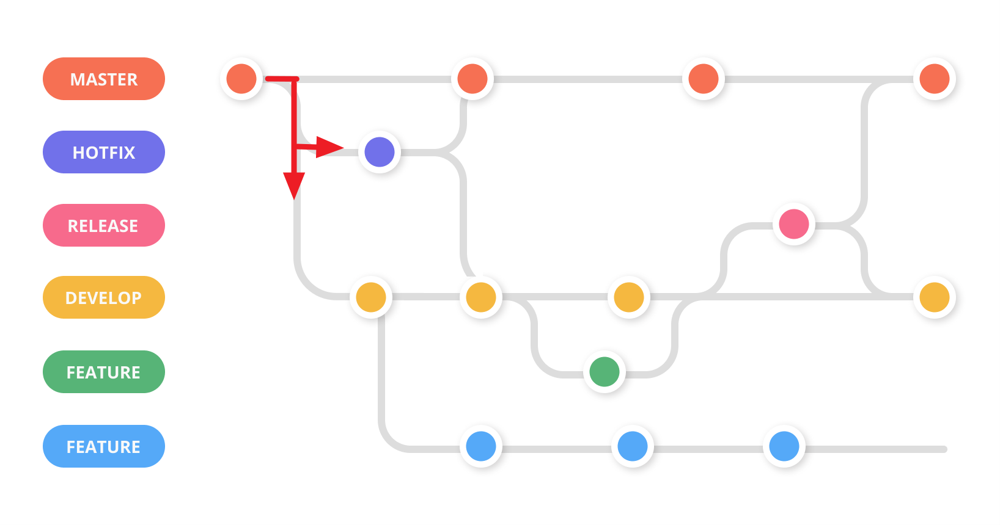
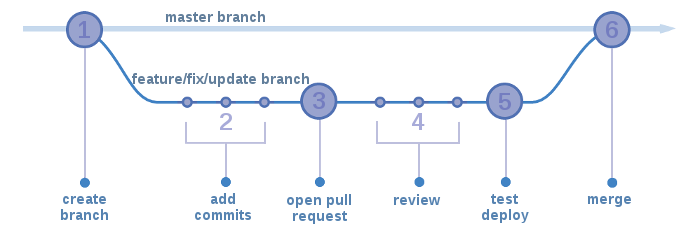

# Git Workflows

https://zepel.io/blog/5-git-workflows-to-improve-development/

您可以使用5個Git工作流程來做版本控制改善開發流程。

## 1. 基本的工作流程

最基本的工作流是只有一個分支-主分支`master`。開發人員直接將版本提交並使用它來發布版本。

通常不建議使用這個工作流程，除非您僅是為了備份方便之後回頭看看，或者您正在進行某些測試想快速上手。

由於只有一個分支，這使您可以輕鬆上手，但使用此工作流程時可能遇到以下缺點：

1. 在代碼上進行多人協作將導致多種衝突。
2. 會有更高的機會將有問題的版本發佈出來。

## 2. 具有Feature分支的工作流程

當您的項目有多個開發人員一同工作時，就必須使用具有Feature分支的工作流程。

假設您有一個開發人員正在開發一項新功能，另一個開發人員正在開發第二個功能。現在，如果還是使用`1.基本的 Git Workflow`兩個開發人員都在同一個分支中工作並向其添加版本，這將使代碼庫陷入混亂，並產生衝突。

為了避免這種情況，兩個開發人員可以從master分支創建兩個單獨的**Feature分支**，並分別新增功能。完成功能後，他們可以將各自的分支合併到master分支，然後進行部署，而不必等待第二個功能完成。

具有Feature分支的工作流程，優點是可以使用同樣基礎版本(master)，透過不同分支進行協作，不必擔心過程中的代碼衝突。

## 3. 新增Develop分支的工作流程

此工作流是開發人員團隊中**較流行**的工作流之一。它與`2.具有Feature分支的Workflow`相似，但多增加了一個開發分支(Develop)概念。

在此工作流程中，主分支(Master)上的版本，都將是穩定的發佈版本。每當團隊想要開發新的產品功能時，他們都會從主分支(Master)分支建立開發分支(Develop)，才開始進行功能開發。

Develop分支包含下一發行版的最新開發更改。開發人員從Develop分支創建Feature分支，並開發新功能。功能準備就緒後，將對其功能進行測試，完成後與Develop分支合併，在所有功能都開發完成的情況下使用Develop分支的代碼進行整體測試，完整確認後發佈至Master。

該工作流程的優勢在於，能使團隊能夠在做出產品的新功能前，**保有穩定的發佈版本**。在各自開發的階段(Feature)中對其進行測試，也不用擔心合併到開發分支(Develop)會破壞之前發佈的穩定版本。儘管維護代碼更容易，但是對於某些團隊來說，這樣做可能會感到有些繁瑣，因為這個開關分支、部屬合併的過程其實挺繁瑣的(其實是有工具可以簡易操作這些功能)。

## 4. Gitflow的工作流程

這是我們之前討論的工作流程非常相似，我們將加入兩個全新的分支Release(發佈分支)與Hotfix(修補分支)，結合使用之後即是gitflow的工作流程。

### release 分支

當各個功能(feature)開發完成合併到(develop)後，測試完成將會開始進行發佈計劃。此時會將會從develop開啟一個release出來。

**不會**有新功能新增到release分支，只會有與發行版本相關的更動。例如版本更新紀錄、版本號的更新...等。

之後會將此分之與master合併代表發佈完成，同時也合併到develop，以便開發分支具有最新的版本訊息。

### hotfix 分支

當線上產品發生緊急問題的時候，會從master分支開一個hotfix分支出來進行修復。hotfix修復完成之後，會合併回 master 分支同時也會合併一份到 develop 。

為什麼要合併回 develop 分支？

如果不這麼做，等到下次發佈週期，問題可能會再次出現了。

那為什麼一開始不從 develop 分支切出來修？

因為 develop 分支的功能可能尚在開發中，這時候如要從這裡切出去修再合併回 master 分支，會將將其他開發中的問題連帶表現到master分支上。

## 5. Github的工作流程

https://guides.github.com/introduction/flow/

https://medium.com/@trylovetom/%E8%AE%93%E6%88%91%E5%80%91%E4%BE%86%E4%BA%86%E8%A7%A3-github-flow-%E5%90%A7-4144caf1f1bf

GitHub Flow 是一個基於分支（Branch）的輕量化工作流程，幫助團隊及專案定期的進行部署。

### 原則

- 所有在 master 分支都是可部署（Deployable）的。
- 要增加新功能時，從 master 開一個此新功能的分支，需詳細敘述，像是 refactor-authentication。
- 經常性的在本地端提交到這個分支，並且推（Push）到遠端同名的分支上。
- 如果需要回饋、幫助或是當你完成這個功能，要合併（Merge）回 master 分支時請使用 Pull Request。
- 如果有人檢核過、測試過並且簽名之後，就可以合併回 master 分支。
- 只要合併之後馬上部署程式碼。

### 建立分支（Branch）

在進行一項專案時，在任何時候你可能有很多不同功能或想法，有些已經準備好要進行開發了，有些則沒有。分支的存在是為了幫助你管理這些工作流程。

當你在專案建立一個分支，代表建立了一個環境來測試你的新想法。在分支所做的修改不會影響 master 分支，所以可以自由的嘗試並提交修改。你可以放心，分支不會被合併，直到準備將它交由某位協作者來檢閱。

> 進階建議
>
> 整個 GitHub Flow 是基於分支，它是 Git 的一個核心概念。這裡只有一個規則：任何在 master 分支中的都是可部署的。
>
> 正因為如此，當在進行一個功能開發或修復時，分離出新分支與 master 是非常重要的。分支命名應該具有描述性（如 refactor-authentication、user-content-cache-key 或是 make-retina-avatars），讓其他人清楚知道分支正在進行的工作項目。

### 新增提交（Commits）

一旦你的分支已經建立，是時候開始進行修改。無論你何時新增、修改或刪除檔案，你會提交更新並將它們加入分支。加入提交的過程讓你可以追蹤分支的工作進度。

提交也產生了一個透明的工作記錄，讓其他人可以了解你做了些什麼，以及原因。每個提交都有相關的提交訊息，用以解釋為什麼做了修改。此外，每個提交被視為一個修改的獨立個體。這使你在找到錯誤或決定朝不同方向時可以復原修改。

> 進階建議
>
> 提交的訊息是很重要的，尤其當 Git 追蹤你的修改並顯示這些提交於伺服器上。透過撰寫清楚的提交訊息，你可以更容易讓其他人了解並提供回饋。

### 開啟 Pull Request

Pull Request 發起了關於提交（Commit）的討論。因為它們緊密的與底層 Git 儲存庫（Repository）結合，如果他們接受你的請求，任何人都能清楚檢視，什麼提交修改將會被合併（Merge）。

你能在開發過程任何時間點，開啟一個 Pull Request，像是：你想分享一些截圖或是想法，但你還沒寫或是只寫了一點點程式碼時；當你卡住了，需要幫助或是建議時；當你準備好讓某人來檢閱你的工作項目時。在 Pull Request 的訊息內使用 GitHub 的 @ 提及系統，來要求某個人或是團隊的回饋。

> 進階提示
>
> Pull Request 對於協作開源專案和管理共享儲存庫的修改非常有用。如果你使用的是 Fork 及 Pull Model，Pull Request 提供了一個方式法來通知專案維護者來考慮使用你所做的修改。如果你使用的是 Shared Repository Model，在合併到 master 分支之前，Pull Request 協助檢閱、討論修改建議。

### 討論與檢閱你的程式碼

當 Pull Request 被開啟，檢閱修改的人或維護團隊可能會提出問題或意見。也許是程式碼風格不符合專案規範、缺少單元測試，或者也許一切看起來都不錯且狀況良好。Pull Request 旨在鼓勵這種類型的討論。

在討論及回饋關於你的提交時，你還可以繼續推送（Push）到你的分支。如果有人反應說你忘了做某件事，或者在程式碼中有錯誤，你可以在分支中修正它並繼續推送修改。GitHub 會在 Pull Request 頁面顯示你的新提交及任何收到的額外回饋。

> 進階建議
>
> Pull request 的評論都是用 Markdown 撰寫，所以你可以插入圖片和表情符號，使用預先格式化的文字區塊，及其他輕量化的格式。

### 部署（Deploy）

你的拉取請求已經被檢閱且分支通過測試，你可以部署他在產品（目前我傾向使用 Staging 測試環境）中去驗證。假如你的分支產生問題，你可以重新部署 master 來回覆上一動。

### 合併（Merge）

現在你的更動已經在產品中驗證，是時候合併你的程式碼回 master 分支。

合併後，Pull Request 保存了一筆程式碼的修改歷史記錄。因為他們是可搜尋的，可讓任何人回頭來了解為什麼及如何作出決定。

> 進階建議
>
> 你可以透過將特定的關鍵字放入拉取請求訊息中，將問題與程式碼做關聯。當你的拉取請求被合併，相關的問題也將被關閉。舉例來說，輸入Closes #32 將會關閉儲存庫中編號 32 的問題（issues）。欲了解更多資訊，請查看我們的[幫助文章](https://help.github.com/articles/closing-issues-using-keywords/)。

