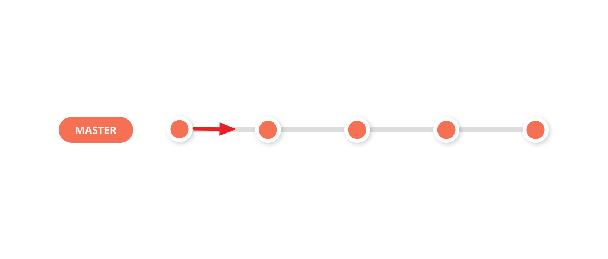
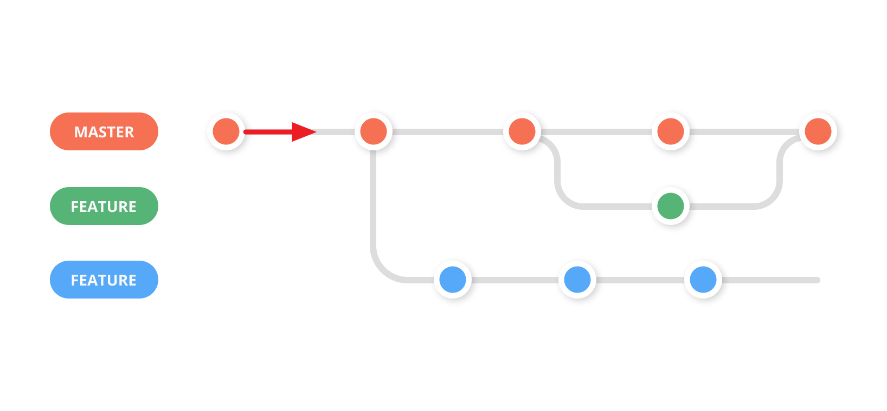
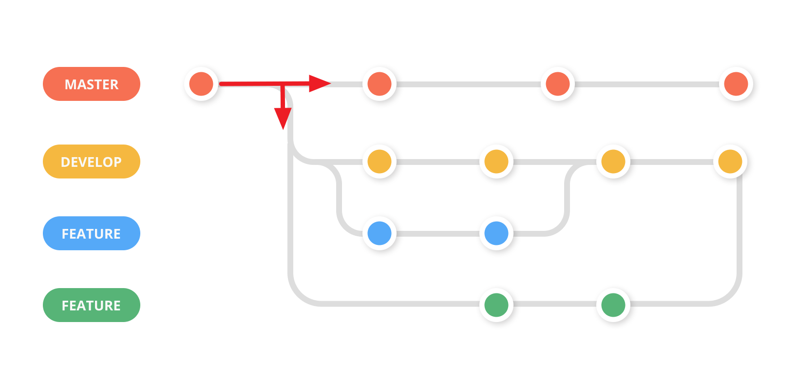

# Git Workflows

https://zepel.io/blog/5-git-workflows-to-improve-development/

您可以使用5個Git工作流程來做版本控制改善開發流程。

## 1. 基本的 Git Workflow

最基本的git工作流是只有一個分支-主分支`master`。開發人員直接將版本提交並使用它來發布版本。

通常不建議使用這個工作流程，除非您僅是為了備份方便之後回頭看看，或者您正在進行某些測試想快速上手。

由於只有一個分支，這使您可以輕鬆上手，但使用此工作流程時可能遇到以下缺點：

1. 在代碼上進行多人協作將導致多種衝突。
2. 會有更高的機會將有問題的版本發佈出來。

## 2. 具有Feature分支的Workflow

當您的項目有多個開發人員一同工作時，就必須使用具有Feature分支的工作流程。

假設您有一個開發人員正在開發一項新功能，另一個開發人員正在開發第二個功能。現在，如果還是使用`1.基本的 Git Workflow`兩個開發人員都在同一個分支中工作並向其添加版本，這將使代碼庫陷入混亂，並產生衝突。

為了避免這種情況，兩個開發人員可以從master分支創建兩個單獨的**Feature分支**，並分別新增功能。完成功能後，他們可以將各自的分支合併到master分支，然後進行部署，而不必等待第二個功能完成。

具有Feature分支的工作流程，優點是可以使用同樣基礎版本(master)，透過不同分支進行協作，不必擔心過程中的代碼衝突。

## 3. 新增Develop分支的Workflow

此工作流是開發人員團隊中**較流行**的工作流之一。它與`2.具有Feature分支的Workflow`相似，但多增加了一個開發分支(Develop)概念。

在此工作流程中，主分支(Master)上的版本，都將是穩定的發佈版本。每當團隊想要開發新的產品功能時，他們都會從主分支(Master)分支建立開發分支(Develop)，才開始進行功能開發。

Develop分支包含下一發行版的最新開發更改。開發人員從Develop分支創建Feature分支，並開發新功能。功能準備就緒後，將對其功能進行測試，完成後與Develop分支合併，在所有功能都開發完成的情況下使用Develop分支的代碼進行整體測試，完整確認後發佈至Master。

該工作流程的優勢在於，能使團隊能夠在做出產品的新功能前，還能**保有發佈的穩定版本**。在各自開發的階段(Feature)中對其進行測試，也不用擔心合併到開發分支(Develop)會破壞之前發佈的穩定版本。儘管維護代碼更容易，但是對於某些團隊來說，這樣做可能會感到有些繁瑣，因為這個開關分支部屬合併的過程其實挺繁瑣的(好在已經有方便的工具可以協助完成這些功能)。